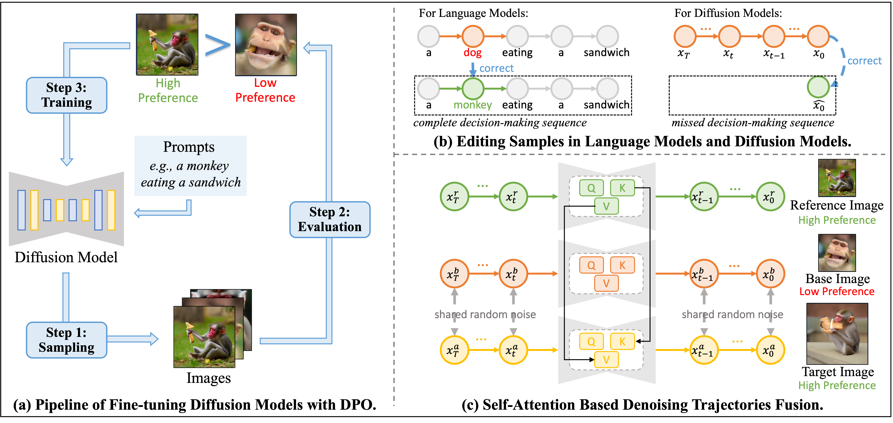

# D-Fusion: Direct Preference Optimization for Aligning Diffusion Models with Visually Consistent Samples

<div align="center">

[](https://arxiv.org/abs/2505.22002)&nbsp;
[](https://github.com/hu-zijing/D-Fusion)&nbsp;

</div>

<p align="center">

<p>

## Introduction

The practical applications of diffusion models have been limited by the misalignment between generated images and corresponding text prompts. Recent studies have introduced direct preference optimization (DPO) to enhance the alignment of these models. However, the effectiveness of DPO is constrained by the issue of visual inconsistency, where the significant visual disparity between well-aligned and poorly-aligned images prevents diffusion models from identifying which factors contribute positively to alignment during fine-tuning. To address this issue, this paper introduces **D-Fusion**, a method to construct DPO-trainable visually consistent samples. On one hand, by performing mask-guided self-attention fusion, the resulting images are not only well-aligned, but also visually consistent with given poorly-aligned images. On the other hand, D-Fusion can retain the denoising trajectories of the resulting images, which are essential for DPO training. Extensive experiments demonstrate the effectiveness of D-Fusion in improving prompt-image alignment when applied to different reinforcement learning algorithms.

## Run

After configuring the environment and downloading the pre-trained diffusion model (*e.g.*, [sd2.1-base](https://huggingface.co/stabilityai/stable-diffusion-2-1-base)), users can first run a **quick test** to check if the code works correctly: 
```bash
## Terminal 1
python3 run_eval.py --config.dev_id 0 --config.exp_name test

## Terminal 2
python3 run_sample.py --config.exp_name test --config.sample.num_batches_per_epoch 2 --config.sample.batch_size 2 --config.dev_id 0 --config.pretrained.model path/to/diffusion --config.train.num_epochs 1 --config.prompt_file config/prompt/template1_3prompt.json --config.mask_thr_file config/prompt/template1_mask.json --config.item_idx_file config/prompt/template1_item.json > log/log_test
```
These two commands should be executed in separate terminal windows. The `run_sample.py` samples images, and performs D-Fusion once the scoring is completed. The `run_eval.py` scores these images. `run_sample.py` will automatically stop after running. In contrast, `run_eval.py` detects new images and scores them in a loop, so users must manually stop it. 

All results will be saved in the directory `./data/test/`. you can see base images, reference images and injected images (target images) there. 

After the quick test completes successfully, users can proceed to run the **full version**: 
```bash
## Terminal 1
python3 run_eval.py --config.dev_id 0 --config.exp_name test2

## Terminal 2
python3 run_sample.py --config.seed 42 --config.exp_name test2 --config.sample.num_batches_per_epoch 8 --config.sample.batch_size 2 --config.dev_id 0 --config.pretrained.model path/to/diffusion --config.train.num_epochs 1 --config.prompt_file config/prompt/template1_train.json --config.mask_thr_file config/prompt/template1_mask.json --config.item_idx_file config/prompt/template1_item.json > log/log_test2
```
All results will be saved in the directory `./data/test2/`.

## Note

To implement D-Fusion during the denoising process, we made direct modifications to the `diffusers` library (version 0.24.0). As evident in the codebase, we copied the entire `diffusers` repository to facilitate these changes.

Unfortunately, such modifications are not automatically compatible with future versions of the library. Therefore, if users wish to experiment with newer versions of `diffusers` or updated diffusion models (*e.g.*, Stable Diffusion 3.5), they will need to make corresponding changes after understanding the code structure. Fortunately, the required modifications are relatively minor. We modified only the following files: 
* `diffusers/models/unet_2d_condition.py`
* `diffusers/models/unet_2d_blocks.py`
* `diffusers/models/transformer_2d.py`
* `diffusers/models/attention.py`
* `diffusers/models/attention_processor.py`

Most of these changes involve simple parameter passing. The core logic of D-Fusion resides in two places:
* The `forward` function of `class UNet2DConditionModel` in `unet_2d_condition.py`
* The `__call__` function of `class AttnProcessor` in `attention_processor.py`

It is worth noting that we used the `LoRAAttnProcessor`, which will be downgraded to `AttnProcessor` at runtime. Thus we made our changes in `class AttnProcessor`. If users are using a different attention processor (*e.g.*, `JointAttnProcessor2_0` for Stable Diffusion 3.5), they need to adapt the corresponding class accordingly.

## Acknowlegement

This repository was built with much reference to the following repositories: 

* [DDPO-Pytorch](https://github.com/kvablack/ddpo-pytorch)
* [MasaCtrl](https://github.com/TencentARC/MasaCtrl)
* [Diffusers](https://github.com/huggingface/diffusers)

## Citation

If our work assists your research, feel free to cite us using:

```
@misc{hu2025dfusiondirectpreferenceoptimization,
      title={D-Fusion: Direct Preference Optimization for Aligning Diffusion Models with Visually Consistent Samples}, 
      author={Zijing Hu and Fengda Zhang and Kun Kuang},
      year={2025},
      eprint={2505.22002},
      archivePrefix={arXiv},
      primaryClass={cs.CV},
      url={https://arxiv.org/abs/2505.22002}, 
}
```
